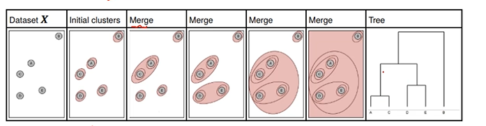

# Hierarchical Clustering

## Two ways of clustering

1. Diverse: from top to bottom
2. Aggomerative: bottom to top

## Basic Principle

### Process

1. Firstly, every sample is a cluster \(Initialization\)
2. Then, merge two clusters into one 
3.  Step 2 loop
4. Until achieve the numer of cluster we set



### Linkage criteria

1. Ward \(**default**\)
2. complete: max distance
3. average \(distance\)

### Main parameters

```python
sklearn.cluster.AgglomerativeClustering()
```

* n\_clusters: number of clusters
* affinity: distance; default: eucidean
* linkage: merge criteria; default: ward

## 


